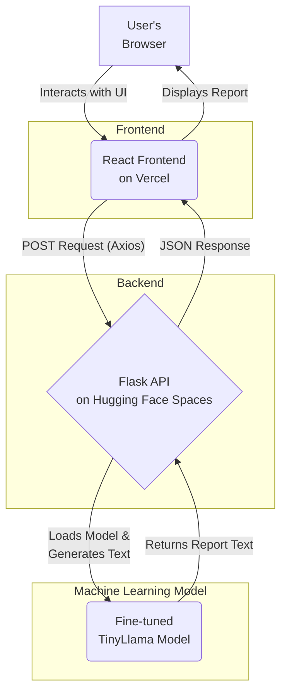

# ⚡️ Utility Compliance Report Generator (UCRG)


A full-stack AI application that leverages a fine-tuned Large Language Model (LLM) to generate natural-language compliance reports from structured JSON data.

---

### ▶️ **[View the Live Demo Here](https://rifukawa-ucrg.vercel.app/)** ◀️

---


## 📖 Table of Contents

- [Project Overview](#-project-overview)
- [Tech Stack & Architecture](#-tech-stack--architecture)
- [Key Skills Demonstrated](#-key-skills-demonstrated)
- [Running the Project Locally](#-running-the-project-locally)
- [Project Learnings & Future Work](#-project-learnings--future-work)

## 🎯 Project Overview

In many industries, especially the utility sector, employees must translate structured incident logs into human-readable reports for compliance, internal review, or public communication. This process is often manual, time-consuming, and prone to inconsistency.

The Utility Compliance Report Generator (UCRG) is a proof-of-concept designed to solve this problem. It provides a simple web interface where a user can input structured data (in JSON format) about an incident. The application then uses a custom-trained AI model to generate a concise, well-formatted, natural-language summary of that incident.

This project demonstrates an end-to-end workflow, from data creation and model fine-tuning to building and deploying a full-stack web application.

## 🛠️ Tech Stack & Architecture

The application is architected with a modern, decoupled structure, separating the frontend, backend, and machine learning model into distinct, scalable services.

### Architecture Diagram



### Technologies Used

| Area            | Technologies                                                                                             |
| --------------- | -------------------------------------------------------------------------------------------------------- |
| **AI / ML**     | **Python**, **PyTorch**, **Hugging Face Transformers**, **PEFT (LoRA)**, **BitsAndBytes**, **TRL**         |
| **Backend**     | **Python**, **Flask**, **Gunicorn**                                                                        |
| **Frontend**    | **React.js**, **Vite**, **JavaScript**, **HTML/CSS**, **Axios**                                            |
| **Deployment**  | **Hugging Face Spaces** (Backend API), **Vercel** (Frontend), **Hugging Face Hub** (Model Hosting), **Git** |

## ✨ Key Skills Demonstrated

This project showcases a wide range of skills essential for an AI/ML Engineer role:

-   **LLM Fine-Tuning:** Successfully fine-tuned a base LLM (`TinyLlama-1.1B`) on a custom, domain-specific dataset using Low-Rank Adaptation (LoRA).
-   **Full-Stack Development:** Built and integrated a complete application with a React frontend and a Python/Flask backend.
-   **API Design & Development:** Created a RESTful API to serve the AI model, including input validation and error handling.
-   **Cloud Deployment & MLOps:** Deployed separate frontend and backend services to the cloud (Vercel, Hugging Face) and managed the model lifecycle on the Hugging Face Hub.
-   **Prompt Engineering:** Designed and implemented a structured instruction-following prompt template for effective model training and inference.
-   **Problem Solving:** Diagnosed and solved real-world issues related to model performance, resource constraints, and cross-origin security (CORS).

## 🚀 Running the Project Locally

To run this application on your local machine, follow these steps.

### Prerequisites

-   Git
-   Python 3.9+
-   Node.js and npm
-   (Optional but recommended for GPU acceleration) An NVIDIA GPU with CUDA installed

### 1. Clone the Repository

```bash
git clone https://github.com/arifaldi13/utility-report-generator.git
cd utility-report-generator
```

### 2. Set Up and Run the Backend

The backend server runs the Flask API and loads the AI model.

```bash
# Navigate to the backend directory
cd backend

# Create and activate a Python virtual environment
python -m venv venv
source venv/bin/activate  # On Windows: venv\Scripts\activate

# Install the required Python packages
pip install -r requirements.txt

# Run the Flask server
# It will start on http://localhost:5001
python app.py
```
*Leave this terminal running.*

### 3. Set Up and Run the Frontend

The frontend is a React application that provides the user interface.

*Open a new, second terminal window.*

```bash
# Navigate to the frontend directory from the project root
cd frontend

# Install the required npm packages
npm install

# Start the React development server
# It will open automatically in your browser at http://localhost:5173
npm run dev
```

You should now have the application running locally and can interact with it in your browser.

## 🧠 Project Learnings & Future Work

This project served as a valuable exercise in building and deploying a complete AI-powered service.

**Key Learning:** The performance of smaller models like TinyLlama is surprisingly strong for specialized tasks, but they are more susceptible to "hallucinations" or factual errors than larger models. The quality of the fine-tuning data is paramount.

**Future Improvements:**

-   **Enrich the Dataset:** Expand the training data with more examples, especially edge cases and negative examples (e.g., `resolved: false`), to improve model robustness.
-   **Implement RAG:** Integrate a Retrieval-Augmented Generation (RAG) pipeline to pull from a "Regulatory Handbook" vector database. This would allow the model to cite specific rules and regulations, dramatically improving its reliability.
-   **Add a Validation Layer:** Implement a post-generation validation step in the backend to check the output against the input for factual consistency before returning it to the user.